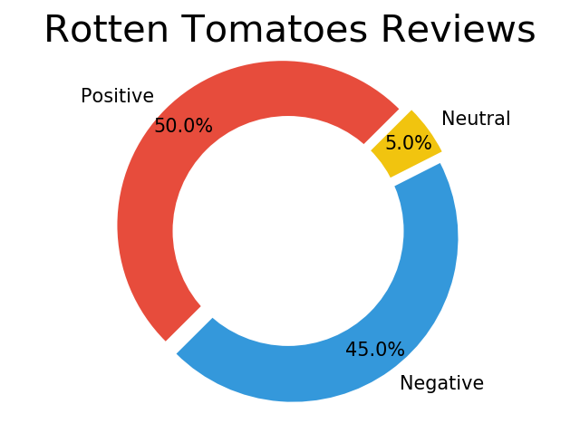
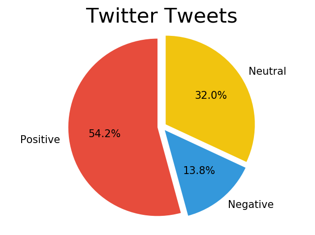

# Sentiment Analysis Comparison of Tweets and Rotten Tomatoes Reviews For Captain Marvel

Is there a difference in the Sentiment Analysis of tweets gathered from Twitter and reviews gathered from Rotten Tomatoes?

This project looks at the tweets pulled from the Twitter API using the hastag #captainmarvel. It pulled around 10,000 tweets from a span of 6 days. Then, from Rotten Tomotoes' Captain Marvel page I scraped the website using BeautifulSoup and got around 12,000 reviews. 

## Sentiment Analysis

## Analysis
The tweets and reviews were stored in arrays that were then processed using the Vader Sentiment Analysis to be determined if they were positive, negative, or neutral. A dictionary kept track of the number of positive, negative, and neutral reviews and tweets which was there used to created the pie graphs

## Conclusion 
Based on the results, the reviews from Rotten Tomatoes were much more negative then the Twitter tweets. The Rotten Tomatoes had a 45% negative rated reviews and the Twitter tweets were 13.8% negative. There was about the same percentage of positive reviews from both Twitter and Rotten Tomatoes. The Twitter tweets had a large percentage of neutral rated tweets. 

This does support my question on whether there would be a difference in the Sentiment Analysis when comparing reviews from Twitter and Totten Tomatoes.

